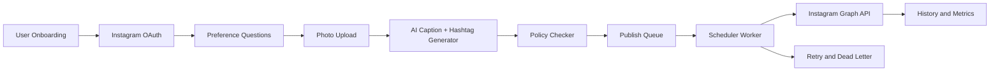

# Architecture overview

## Objective

Build a multi-tenant product where users can connect Instagram accounts, generate captions/hashtags, and auto-publish on configurable schedules.

## High-level components

1. **Flutter client**
   - Web + Android + iOS in a single codebase
2. **API service (NestJS)**
   - Auth, profile preferences, schedule rules, queue management
3. **Worker service (future slice)**
   - Background publishing, retries, idempotency
4. **Storage**
   - PostgreSQL (transactional data), Redis (jobs/queues), S3-compatible media storage

## System flow

## Config-first principles

- No business constants are hardcoded in controllers.
- Defaults and feature flags are centralized in config modules.
- Public configuration is exposed via an API endpoint to avoid duplicate constants across clients.
